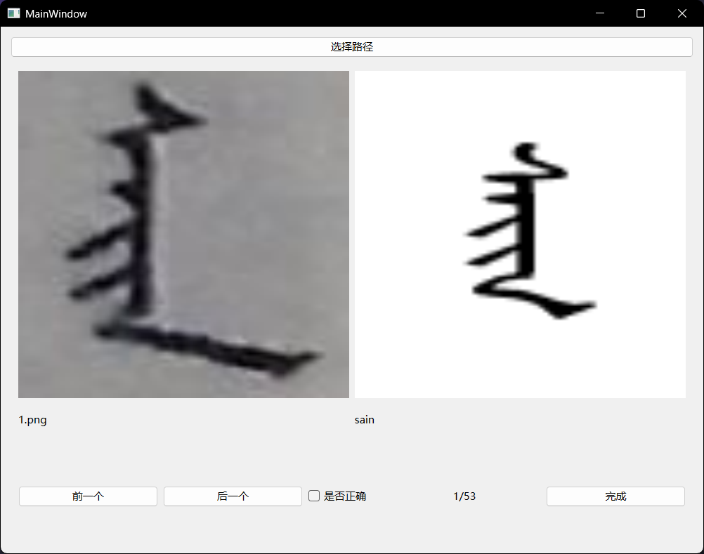

# a-little-tool
看右边的release，下载exe点开就行

## 使用之前

保证你的目录结构像是这样的且路径不要有中文字符(硬编码的路径，目录结构不对一定不能正常工作)

```text
└─222
    │—Image_222.jpg
    │—Image_222_clustered.txt
    │
    └─Image_222
            1.png
            ....
```

创建一个用页号命名的文件夹， 把同一页的文件放在这个文件夹下

点开exe，点击选择路径刚刚创建的文件夹



右边是词典网站的图片，比对无误后勾选是否正确选择框，然后点下一个

比对完成后点击完成按钮，程序会自动识别行列号和重命名文件，重命名完成后程序会自动退出

## ps.
- 如果有文件未被重命大概率是重复分割的图片(简单的像素距离判断，也许可能大概不准确)
- 无注释高血压编码，谨慎阅读

Have a good day :)


